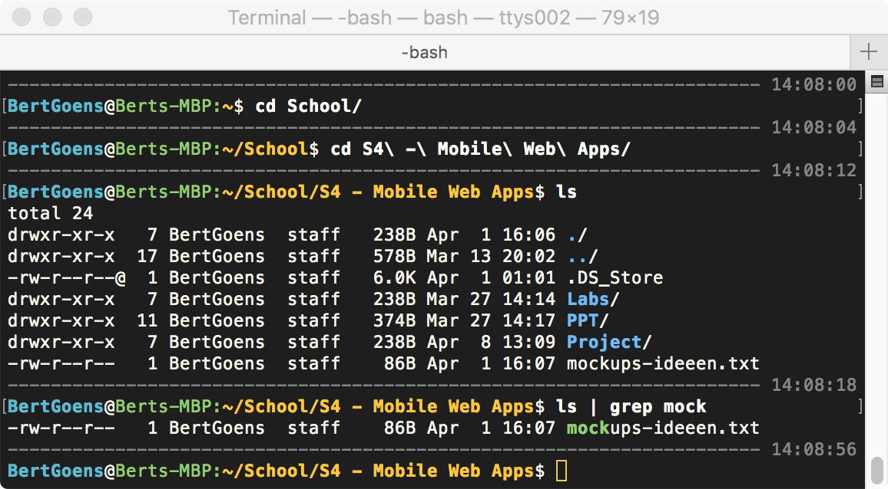
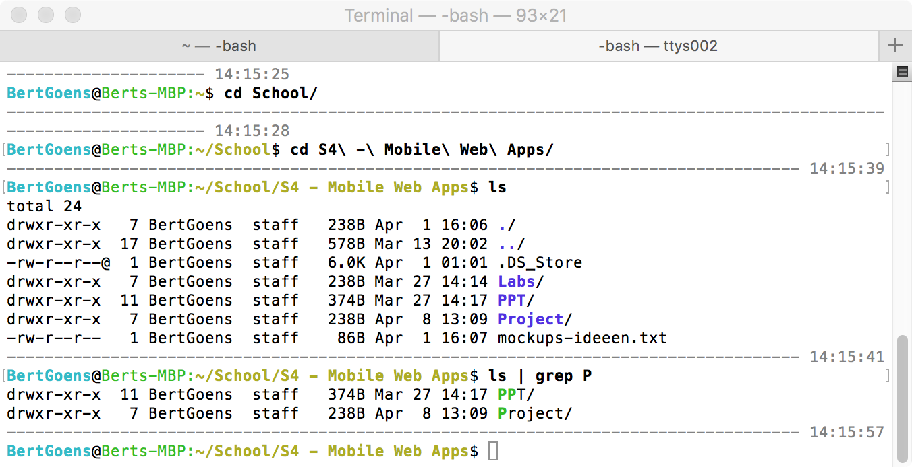

# SUPER-TERMINAL

An enhanced standard mac OSX terminal.  
Giving you several benefits: 

- Readability!
- Keeps command execution time
- Enables colors
- Enables `ls` colors
- Enables `grep` colors
- Easily self-adjustible 

**How to use:**
1. Execute  
$ `open -a TextEdit ~/.bash_profile`  
2. Paste in the contents of bash_profile.sh
3. Save the file 
4. Open a new terminal window  

## Screenshots

### Japanesque Superterminal

  

I use my bash_profile settings in combination with the Japanesque terminal theme found in [osx-terminal-themes](https://github.com/lysyi3m/osx-terminal-themes) for a superb look.  

### Default Superterminal

